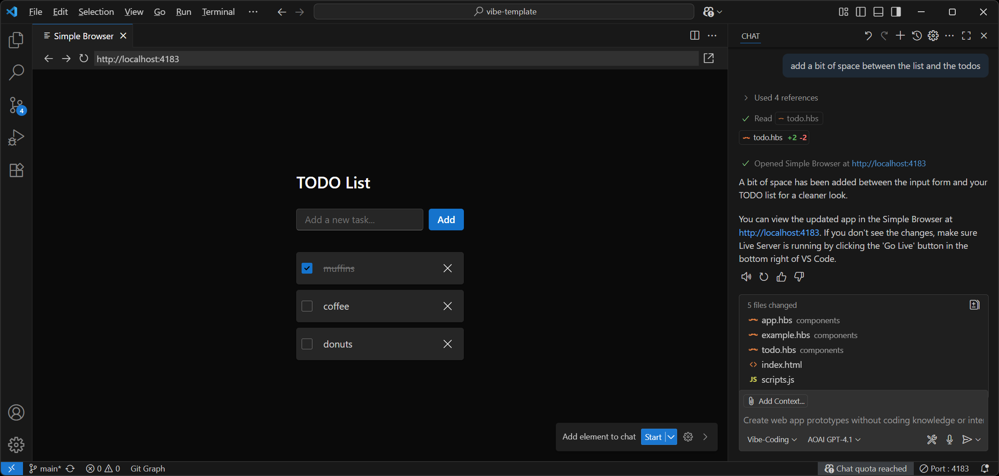

# Vibe Template

***A template for good vibes and rapid prototypes***

This template helps you configure VS Code to run in a "vibe-code" mode, 
allowing you to create apps through Copilot without touching code!

## Setup

1. Get the files in one of two ways:
   - **Easy:** Download the [vibe-template.zip](https://github.com/aipx-proto/vibe-template/archive/refs/heads/main.zip)
   - **Git:** Create a new repo from this repo's [template](https://github.com/new?template_name=vibe-template&template_owner=aipx-proto)
2. Open the project in VS Code.
3. Open GitHub Copilot Chat (the icon is at the top-center, to the right of search).
4. In the bottom left of the chat, select the "Vibe-Coding" mode (it may say "Ask" or "Agent" by default).
5. Prompt Copilot to make you an app.

## Figma MCP Integration

This repo connects to Figma's MCP server, allowing direct integration with your Figma desktop files. 
You will need to enable MCP in Figma desktop for this to work. Ask Copilot for help if needed.